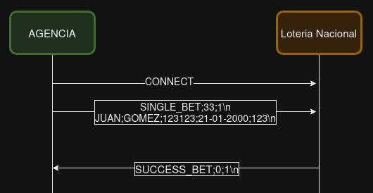

# Ejercicio 1

### 1 - Modificar la definición del DockerCompose para agregar un nuevo cliente al proyecto

Para poder agregar un nuevo cliente, fue necesario editar el archivo 'docker-compose-dev.yaml' agregando debajo del Client1 un Client2.

El client 2 va a tener un nuevo nombre de container y otro CLI_ID.

### 1.1 - Definir un script (en el lenguaje deseado) que permita crear una definición de DockerCompose con una cantidad configurable de clientes.

Siguiendo con la lógica del ejercicio 1, para este punto programe un Script en Python el cual genera el archivo docker-compose-dev.yaml' dinámicamente según la cantid
de clientes recibidos por parámetros. 

Nuevamente, cada uno tendrá su nombre de contenedor correspondiente asi como el CLI_ID.

Para ejecutarlo, es necesario estar dentro de la carpeta del proyecto, ahi se encontrará el archivo 'ScriptDockerDefinition.py'. 

Ejecutar el siguiente comando definiendo un n (cantidad de clientes):

```
python3 ScriptDockerDefinition.py n
```
---
# Ejercicio 2

### Modificar el cliente y el servidor para lograr que realizar cambios en el archivo de configuración no requiera un nuevo build de las imágenes de Docker para que los mismos sean efectivos. 
### La configuración a través del archivo correspondiente (config.ini y config.yaml, dependiendo de la aplicación) debe ser inyectada en el container y persistida afuera de la imagen (hint: docker volumes).

Para la resolución de este punto primero fue necesario agregar volumenes para el servidor y para el/los cliente/s.

Para eso se sumaron a la definicion de los contenedores las siguientes lineas:

```
#Servidor
volumes:
  - ./server/config.ini:/config.ini

#Cliente
volumes:
  - ./client/config.yaml:/config.yaml
```

Estos volumenes permiten tener un punto de contacto entre el host y los contenedores, de manera que si hago un cambio a nivel host, se ve plasmado en los contenedores que tengan ese volumen.

Ademas de los volumenes fue necesario extraer del Dockerfile del cliente la linea:

```
-COPY ./client/config.yaml /config.yaml
```

Ya que sino se estaría pisando la version del archivo de configuración.

Para probar su funcionamiento, levante los contenedores con el make docker-compose-up, luego realice modificaciones en los archivos de configuración e 
hice un start de los contenedores que se habían buildeado.
---
# Ejercicio 3

### Crear un script que permita verificar el correcto funcionamiento del servidor utilizando el comando netcat para interactuar con el mismo. Dado que el servidor es un EchoServer, se debe enviar un mensaje al servidor y esperar recibir el mismo mensaje enviado. Netcat no debe ser instalado en la máquina host y no se puede exponer puertos del servidor para realizar la comunicación (hint: docker network).

Para la resolución de este ejercicio cree una carpeta dedicada llamada 'tester' aqui se encuentran:
* Archivo Dockerfile el cual levanta la imagen de [subfuzion/netcat](https://hub.docker.com/r/subfuzion/netcat).
* Archivo de configuración para poder definir los parámetros usados por el script a la hora de testear: puerto, ip, repeticiones, esperas entre mensajes, timeout para espera conexion, mensaje a enviar
* Archivo bash generado por el Script, el mismo será ejecutado por el contenedor una vez iniciado.

Para mandar mensajes al servidor se da uso a la docker network 'testing_net' y a netcat como como herramienta para el envio de mensajes.

Con el siguiente codigo bash se envia un msg al servidor y dado que es un echo server se toma la respuesta que se espera sea la misma a la enviada:

```
if echo {msg} | nc -w {timeout} server {port} | grep -q {msg}; then
    echo "Server Ok"
  else
    echo "Server Err"
```

Programe un Script python que genera este código bash a partir de los parámetros de configuración y además buildea el Dockerfile de tester y levanta el contenedor.
Para usarlo (necesario estar dentro de la carpeta del proyecto) ejecutar:

```
python3 ScriptServerTester.py
```
---
# Ejercicio 4

### Modificar servidor y cliente para que ambos sistemas terminen de forma graceful al recibir la signal SIGTERM. Terminar la aplicación de forma graceful implica que todos los file descriptors (entre los que se encuentran archivos, sockets, threads y procesos) deben cerrarse correctamente antes que el thread de la aplicación principal muera. Loguear mensajes en el cierre de cada recurso (hint: Verificar que hace el flag -t utilizado en el comando docker compose down).

Para este ejercicio se debio incorporar al Cliente y Servidor un handler de la señal SIGTERM. 

Esta señal es enviada por docker al hacer un stop a un container, el flag -t setea un tiempo el cual docker espera para handlear esta señal de manera graceful, sino directamente manda un SIGKILL.

Del lado del servidor (python) se creo un handler que se activa con la señal, aqui se setea un flag que detiene el loop del servidor y además se cierra el socket del mismo.

Para el cliente (go) entre cada iteración se chequea si se recibió la señal, en ese caso se cierra la conexion y termina el loop.

Para probar su funcionamiento se levanta todo con el make docker-compose-up y los logs con make docker-compose-logs y en otra terminal se hace un make docker-compose-stop
esperando una salida correcta del programa.
---
# Ejercicio 5

### Modificar la lógica de negocio tanto de los clientes como del servidor para nuestro nuevo caso de uso.

---

Se define un protocolo, con mensajes de tipo texto divididos con delimitadores.

Los mensajes se conforman por un Header y un Payload, el Header nos dará la información necesaria para saber procesar el contenido del Payload:

**Estructura del Header:**     

`TIPO_MENSAJE;LARGO;AGENCIA\n`

Todo el header se delimita con un '\n' y los componentes del header con ';'. 

TIPO_DE_MENSAJE: Indica que se esta mandando en el Payload.<br>
LARGO: Indica la cantidad de Caracteres enviados en el Payload.<br>
AGENCIA: Indica el ID del cliente (agencia) que envia la apuesta.<br>

La estructura del Payload podría variar según su tipo, para este ejercicio se utiliza:

**Mensaje SINGLE_BET:** Representa una apuesta individual, el cliente la envia a el servidor.

`NOMBRE;APELLIDO;DOCUMENTO;CUMPLEAÑOS;NUMERO\n`

**Mensaje SUCCESS_BET:** Mensaje enviado de Servidor a Cliente, indica que la apuesta fue procesada. No tiene Payload.

**Ejemplo simple del protocolo:**




Para evitar casos de short read se cruza el largo que debería haber llegado según el header y el largo real recibido, en caso de no ser iguales, se esperara un nuevo mensaje que será concatenado con este.

En el caso de sort write se chequea que la cantidad enviada sea la esperada sino se envia el Header (con el largo actualizado) más lo que quedo pendiente por enviarse.
