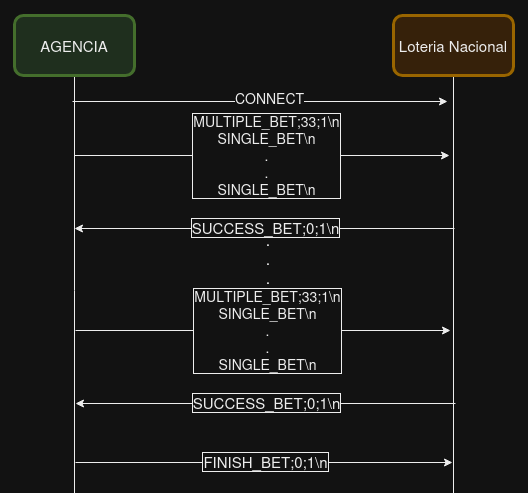

# Ejercicio6

### Modificar los clientes para que envíen varias apuestas a la vez 

---

Para este Ejercicio se extiende el protocolo planteado para el Ejercicio 5. Siendo el header identico.

Pero se agregan nuevos tipos de mensajes:

**MULTIPLE_BET:** Misma idea que SINGLE_BET pero permitiendo tener varias apuestas a la vez, las mismas se separaran por un \n.

`SINGLE_BET\n`...
`SINGLE_BET\n`

**FINISH_BET:** Al empezar un envio de multiples bets se utiliza este mensaje para marcar el fin del mismo. No cuenta con Payload.

Por otro lado, se agregan constantes en el codigo que permiten modificar la cantidad de apuestas por mensaje, asi como el buffer maximo. La idea con el short read y write se mantiene identica al ejercicio 5.
Fue necesario que los archivos csv sean copiados con el dockerfile del cliente para tener acceso a los mismos, los mismos son procesados por su correspondiente agencia linea a linea.

**Ejemplo del protocolo:**

